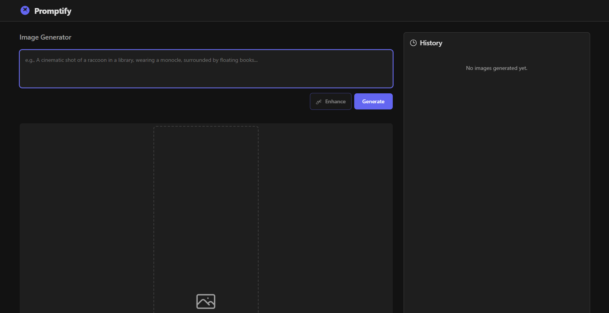
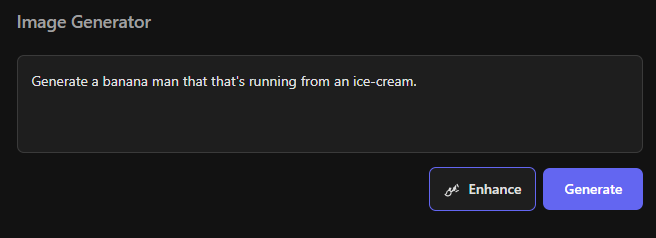
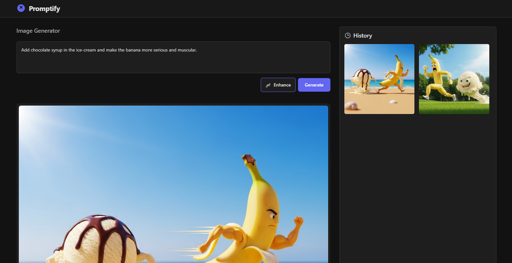

# ⚡ Promptify

**Promptify** is an AI-powered prompt generation web app built with **React + TypeScript + Vite**. It helps users create, organize, and visualize text prompts efficiently with a sleek and responsive UI.

---

## 📸 Preview

Images are located in the `assets/` folder.

| Preview 1 | Preview 2 |
|------------|------------|
|  |  |

| Preview 3 | Preview 4 |
|------------|------------|
|  |  |

---

## 🚀 Features

- Modern React + TypeScript + Vite setup  
- Organized components for easy development  
- AI-powered prompt generation logic  
- Clean UI with responsive layout  
- Local environment configuration support  

---

## ⚙️ Installation

```bash
# Clone the repository
git clone https://github.com/yourusername/promptify.git

# Navigate to project directory
cd promptify

# Install dependencies
npm install

# Start the development server
npm run dev

---

📁 Folder Structure

promptify/
│
├── assets/                # Images and screenshots
│   ├── pic1.png
│   ├── pic2.png
│   ├── pic3.png
│   └── pic4.png
│
├── components/            # UI components
│   ├── Footer.tsx
│   ├── Header.tsx
│   ├── HistoryPanel.tsx
│   ├── Icons.tsx
│   ├── ImageDisplay.tsx
│   └── PromptForm.tsx
│
├── services/              # Service files
│   └── geminiService.ts
│
├── .env.local             # Local environment variables
├── .gitignore             # Node.js ignore file
├── App.tsx
├── index.html
├── index.tsx
├── metadata.json
├── package.json
├── tsconfig.json
├── types.ts
└── vite.config.ts

---

🧾 License
This project is licensed under the MIT License — see the LICENSE file for details.

---

💡 Notes
.gitignore is configured for Node.js & Vite environments.

Assets folder contains all preview images.

Built for simplicity, modularity, and speed.

